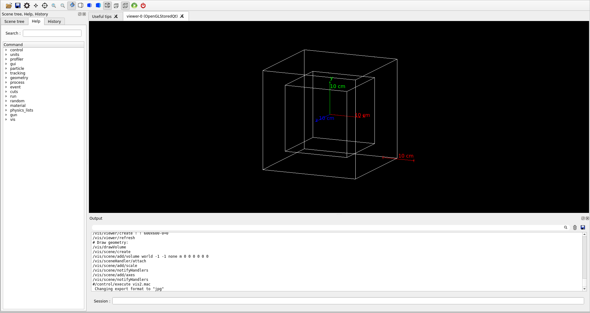

# A basic skeleton for testing Geant4 installations

Contains a simple water box of 10 cm x 10 cm x 10 cm and particle gun set to 6 MeV gamma.

In order to set the path for Geant4 libraries you need to run the following command first

- For snap-based installations:  
```source /snap/gate/48/usr/local/bin/geant4.sh```

`48` denotes the version and you should enter the correct version should the above command fail. 

The above command should be run everytime you open a new terminal. Alternatively, you can add it to your .bashrc file.

- For direct installlations:  
Source the geant4.sh file which is usually found in the bin folder of the installation


Next, create a ```build``` folder inside the main directory (```g4-test``` in this case).

Run the following commands in sequence:
- cd build
- cmake ../
- make
- ./exampleB1

If everything works well, you should see an UI like this:




In case you encounter any errors, please raise an issue on github.

Additionally, to analyse the simulation data used in the exercises, we will use python. You will have to ensure that python the following libraries are installed:

- numpy (pip install numpy)
- matplotlib.pyplot (pip install matplotlib)
- pandas (pip install pandas)